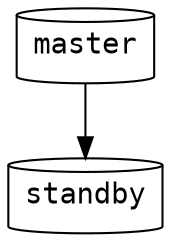

# README
This repository holds an example of how to setup postgres for hotstandby.

## Docker
Docker fulfills the dual roles of making the process of setting up postgres both repeatable as well as transparent because every detail is scripted.

The images are based on the official postgres image from docker hub:
https://hub.docker.com/_/postgres/



## How to start
1. Build all docker images, e.g. by executing `build-all.cmd`.
2. Start and connect the containers, e.g. by executing `compose.cmd`.

If the hotstandby setup was successful, you should see the following lines in the hostandby log:
```
hotstandby_1  | 2019-04-14 12:09:04.803 UTC [66] LOG:  entering standby mode
hotstandby_1  | 2019-04-14 12:09:04.811 UTC [66] LOG:  redo starts at 0/2000028
hotstandby_1  | 2019-04-14 12:09:04.811 UTC [66] LOG:  consistent recovery state reached at 0/3000000
hotstandby_1  | 2019-04-14 12:09:04.812 UTC [1] LOG:  database system is ready to accept read only connections
```

## Connect to the databases
You can connect to the `master` database on port `5432` and to the standby `database` on port `5433`.
The database, username and password `postgres`.

## Verify that Hotstandby is working
You can verify that the hotstandby is working by inserting into the master database and selecting from master and hotstandby:

```bat
docker exec postgres_master_1 psql -U postgres -c "insert into log (text) values ('this is a test')"
docker exec postgres_master_1 psql -U postgres -c "select * from log"
docker exec postgres_hotstandby_1 psql -U postgres -c "select * from log"
```

The hotstandby should be in read-only mode:
```bat
docker exec postgres_hotstandby_1 psql -U postgres -c "insert into log (text) values ('this is a test')"
ERROR:  cannot execute INSERT in a read-only transaction
```

## TODO
- [x] Remove volumes without pruning all volumes
- [x] Configure an Replication Slot to prevent WAL recycling
- [ ] Instead of `sleep 10` wait until the master becomes available for backup restoration.
- [ ] Add explanation of how everything works
